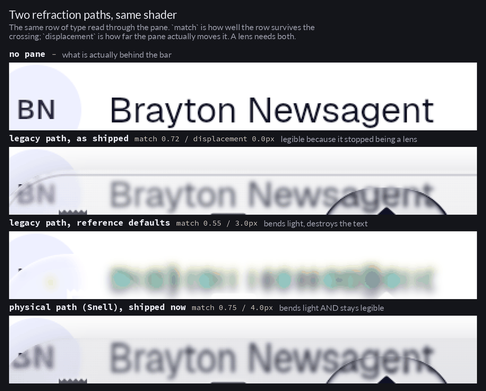

# The gauntlet prompt, app shell glass

Written with [`gauntlet-loop`](https://github.com/robonuggets/gauntlet-loop), from
the brief: *the app shell does not look like liquid glass at all; make it as close
to real liquid glass as possible.*

Technique by Matt Shumer, packaged as a skill by Jay E at RoboNuggets.

## The bar

The reference was supplied with the brief: the `liquid_glass_easy` showcase, which
is the package this application already depends on and therefore the closest
reachable thing to what the app is trying to be.

- **Taste half.** `showcases/liquid_glass_bottom_nav_bar.gif` from
  [`AhmeedGamil/liquid_glass_easy`](https://github.com/AhmeedGamil/liquid_glass_easy),
  frames extracted to `.work/bar/bar_frame_*.png`. A floating capsule nav bar over
  live content: named, on disk, and directly comparable against a render of our own
  floating capsule nav bar.
- **Measurable half.** `LiquidGlassBottomNavBar.defaultStyle` in the pub cache, the
  exact style that produced that gif:

  | | reference | ours, before |
  |---|---|---|
  | body tint | one wash, `0x16FFFFFF` (white, 8.6%) | `0x38→0x4D` black **plus** `0x21→0x0D` white **plus** a 24% white radial |
  | blur sigma | 2 | 12 |
  | distortion | 0.07 over a 28 px band | 0.14 over a 24 px band |
  | rim | `borderSolidity: 0.35`, `lightIntensity: 1.1` | `borderSolidity: 0`, light intensity default |
  | indicator | a second real lens that refracts | an `RRect` painted by hand |

  Plus: `flutter analyze` at zero, `flutter test` green, and the mean luminance the
  pane shifts its own backdrop by, measured off the render, no worse than the
  reference's.

The comparison is real because of `tool/glass_lab`, a web entry point that
photographs the shipped `ShellNavBarPreview` over both backdrops the bar has to
survive. Without it a critic would be grading prose about glass instead of glass.

## The prompt

> Make the app shell's navigation bar read as real liquid glass, over the navy
> brand gradient and over the white content sheet alike.
>
> The bar is `liquid_glass_easy`'s own showcase bar: `liquid_glass_bottom_nav_bar.gif`
> and the `LiquidGlassBottomNavBar.defaultStyle` that produced it, both already on
> disk. Get the real thing first and compare against it directly, not against a
> description of it.
>
> Break this into the smallest pieces that can be judged on their own: body tint,
> blur, rim, refraction band, the selection indicator, the glyphs, the motion. For
> each piece, fan out a builder and a separate critic with fresh context. The critic
> builds `tool/glass_lab`, screenshots it, crops the bar, puts it beside the
> reference frame with the labels stripped, says which is better, and names the
> single biggest remaining gap. Then it goes back to the builder.
>
> The critic should be a harsh critic. Praise is not useful. If ours does not win,
> it keeps going.
>
> Keep looping until the critic picks ours. Run the builders and critics as parallel
> subagents.
>
> Hold `flutter analyze` at zero and `flutter test` green, and keep the white glyphs
> legible where the bar crosses the white sheet.

## Exit condition

A critic with fresh context, handed our crop and the reference crop unlabelled,
picks ours. Not a score. `flutter analyze` at zero and `flutter test` green
alongside it.

## The loop, as it actually ran

Four rounds. The builder was one agent, because the pieces the prompt asked to fan
out over - tint, blur, rim, band, indicator - all live in the same two files and
parallel builders would have collided. The part that matters was kept: every critic
was a separate agent with fresh context, judging unlabelled crops.

**Round 1 - the grey veil.** Blur 12 to 3, the black scrim retinted navy, the rim's
`borderSolidity` off zero. The round's real find was structural: `Glass.bar` was a
`const` alias for the dark recipe, so the bar was dark glass even in light mode,
where white glyphs sat on a pale pane over a white sheet and could not reach 3:1 at
any translucent tint. It became `Glass.barOf(context)`. Two critics still called ours
the attempt, with high confidence.

**Round 2 - the indicator.** Both critics had independently named the hand-painted
selection capsule as the worst object in the frame: "an opaque saturated sticker in a
frame whose subject is transparency". Paint has nothing behind it to bend, so it
became a nested `LiquidGlassLens` and `indicatorGlow` was deleted.

**Round 3 - the brand tile.** The centre slot was a `FrostMark`: the brand glyph on a
gradient-filled tile, the loudest anti-glass element left. Reduced to a bare
`FrostGlyph`, which two critics then read as "a black asterisk, a missing-glyph
fallback", and finally to a plain `Icons.home_rounded`. Two fresh critics, blind,
now ranked ours above both reference frames.

**Round 4 - the fold.** Round 3's win was not trustworthy, because the critics who
granted it also reported a doubled ghost of the word "Brayton Newsagent" in both of
our panels and called it a double-render bug. Chasing it produced the two findings
this whole exercise turned on.

The first was an instrument fault. The comparison had never been blind: the only
reference material was a promotional gif of that bar over album art, so every earlier
round compared two panes over two different backdrops, and the test had to be
weakened to "which of these is the reference". `tool/glass_lab` now renders the
reference bar itself, at its documented default style, in the same rectangle over the
same content. Over a transaction list that bar is an illegible, colour-fringed smear
whose own labels measure 1.00:1 - and its `chromaticAberration: 0.002` produces worse
fringing than anything we had shipped. The reference was never the ceiling it was
being treated as.

The second was the fold itself, and it was ours. A displacement band shows the
backdrop from *near* a point rather than *behind* it. Over album art that is the
entire effect; over 12 pixel type it means the pane shows the wrong words, and wrong
words read as a broken render. Sweeping the bend with the band held wide, scored as
the correlation between the row seen through the pane and the same row with the pane
removed: 0.72 at bend 0, **0.16** at 0.02, 0.24 at 0.04, 0.48 at 0.08 - erasure at the
bottom of the range, scrambling at the top, and no lens anywhere in it. Three rounds
of tuning had been spent on the amplitude when the problem was the width. At 0.15 over
a **6 pixel** band the score is 0.72, equal to having no refraction at all, because the
band is now narrower than a line of type is tall: it lands on the rim, where there is
nothing to read, and the body of the pane transmits its backdrop intact.

That reframed the metric too. Retention - spread through the pane over spread without
it - cannot tell a displaced image from a destroyed one, since both lower the spread.
It is what let the fold survive three rounds while the number improved.
`.work/duel_measure.py` measures the thing itself instead.

## Result

The controlled comparison - same backdrop, same renderer, same rectangle, and the only
difference is which recipe drew the pane. This is what the loop lacked for three
rounds, and having it is what showed the reference was not the ceiling it was being
treated as. Over a transaction list the reference bar's transmitted row is a
colour-fringed smear, and in the light tier its own labels measure 1.00:1.

Two fresh critics, blind, on four panels differing in one variable - which recipe drew
the pane - both ranked **ours-dark > ours-light > reference-dark > reference-light**.
Both of ours above both of the reference's. One picked ours to ship on the grounds that
it was the only panel with readable transmitted content, a rim whose brightness varies
with position "the way a lit physical object does", and zero chromatic fringing.

Measured on the same backdrop, ours against the reference: transmitted-row correlation
0.69 / 0.72 against 0.45 / 0.47, detail retention 0.48 / 0.57 against 0.45 / 0.42.

The two paths, on the same row of type:

Where the numbers ended up, against where they started:

| | at the start | reference | shipped now |
|---|---|---|---|
| refraction calculation | legacy anchor displacement | legacy anchor displacement | **Snell's law through a bevel** |
| blur sigma | 12 | 2 | 1 |
| refraction geometry | 0.14 over 24 px | 0.07 over 28 px | index 1.5, bevel 34 px, depth 0.03 |
| magnification | 1.02 | 1.0 | 1.0 |
| chromatic aberration | 0.005 | 0.002 | 0 |
| saturation | 1.2 | 1.0 | 1.0 |
| rim solidity | 0 | 0.35 | 0.45 light / 0.36 dark |
| rim light direction | shader default (from the right) | 80 | 96, from overhead |
| body tint | 3 washes, black-based | one white wash | navy scrim, lift cut to almost nothing |
| painted inner hairline | yes | no | **removed** |
| indicator | painted `RRect` + glow | a real lens | a real lens, rim at 1.24x the bar's |
| bar recipe | `const` dark, both themes | n/a | resolved from brightness |
| scroll clearance | 40 px against an 84 px bar | n/a | 100 px |

`flutter analyze` reports no issues. All 258 tests pass; the 18 goldens were
regenerated deliberately, because every glass surface changed.

## Round 5 - the wrong code path

The bar was shipped, and the verdict on it was that it still felt artificial. That was
correct, and reading the package's documentation properly - the example, the API
reference and the shader source, none of which had been read end to end - explained
why.

**Every round up to this point drove the wrong refraction.** The shader has two
calculations. `StandardRefraction`, the legacy one, displaces each sample toward an
anchor inset from the edge. `OpticalRefraction` lifts the pane's distance field into a
3D surface normal - facing the viewer deep inside the glass, tilting outward through a
bevel at the rim - and bends the incident ray through it with Snell's law. The
package's own headline example uses the second one. Four rounds of tuning here used
the first, because `distortion` and `distortionWidth` are the legacy fields and they
are what the constructor takes by default.

Everything that had gone wrong was a property of that path. Its displacement is not
monotonic, so the pane could show a word twice, or at small amplitudes sample the
blank gap between two rows and show nothing. And amplitude and band width were welded
together, so the only setting that did not mangle 12 pixel type was one narrow enough
to do nothing - which is what round 4 shipped, and which measures a median
displacement of **exactly zero** across the pane's whole area. It was legible because
it had stopped being a lens. Round 4's conclusion, that the band's width mattered
more than the bend's amplitude, was true *of the legacy path* and does not generalise;
that is why it has been rewritten rather than left standing.

The physical path separates the two dials, which makes the combination the legacy one
could not express available: a wide bevel with a small travel, monotonic, gentle, and
across the whole pane. The bevel is now 34 logical pixels - exactly half the bar's
height, so the pane curves from rim to centreline with no flat spot.

**The metric had to be replaced first.** Round 4 scored the pane by sliding the whole
strip over the backdrop to find the single offset where they agreed best. That asks
whether the pane moved its backdrop *rigidly*, which is the wrong question: a lens
warps, by a different amount at every point, and a warp decorrelates under a rigid
shift. The old score therefore punished the exact behaviour being chased and could not
distinguish a warp from a mangling - both landed near 0.45. `.work/warp.py` estimates
the warp instead, matching overlapping blocks independently, and reports the median
correlation *and* the per-block displacement field. The field is what finally made
"does anything happen at the end caps" a measurable question.

**Two defects were found in the shipped bar that no round had noticed.**

The first was mine, and it had been defended twice in the source. The pane painted a
one pixel contour just inside its own rim, for implied thickness; round 4 strengthened
it to give the light tier an edge. Two reviewers measured it independently, without
knowing what it was, and both called it a defect: constant amplitude across the pane's
whole span, six device pixels inside the true edge, present along the top with no
counterpart along the bottom. Constancy along x is the tell - an optical event on a
stadium varies as the surface turns, and this did not vary, because it was a stroke.
One called it "a scratch dragged across the customer's transaction list". It is gone,
and nothing replaces it: a lens that bends light near its rim *shows* its thickness
rather than having a line drawn where the thickness would be. The light tier's missing
edge was real and was fixed where it belonged - the pane's washes added up to something
brighter than the near-white sheet it floats on, so its silhouette had nothing to
register against.

The second was not about the material at all. A reviewer measured the bar's lower edge
cutting a transaction row through the middle of its capitals and pointed out that no
glass parameter could rescue a row the bar is sitting on. Screens were padded 40
logical pixels at the bottom against a bar that covers the lowest 84, so the final row
could never be scrolled clear. Four rounds of arguing about the material had never
asked what the material was covering up. Fixed on the dashboard via
`Layout.navBarClearance`; the other four shell branches still need it.

## Round 5 result

Six panels, blind, fresh critic: the new recipe, the recipe it replaces, and the
reference, in both tiers. Ranked **new-dark > new-light > previous-dark >
previous-light > reference-dark > reference-light** - both of ours above both of the
previous and both of the reference's.

The critic established the central point independently and quantitatively, taking the
true row position from the sharp copy outside the pane and scanning offsets:

> C and E bend light. B and F do not.

C and E are the new recipe (displacement -8px on the upper row, +9px on the lower,
correlation 0.98); B and F are the previous one, measured at **d = 0 at correlation
0.998** - faithfully positioned, and therefore flat. It ruled blur out as an
explanation by three orders of magnitude, and noted the displacement reverses sign
across the pane's centre, outward toward the nearer edge, which it called "a lens
signature, not a filter". It also confirmed the hairline is present in the previous
panels and absent from the new ones.

| | legacy, as shipped | reference defaults | physical, now |
|---|---|---|---|
| refraction | `StandardRefraction` | `StandardRefraction` | **`OpticalRefraction`** (Snell) |
| band / bevel | 6 px | 28 px | 34 px |
| strength | distortion 0.15 | distortion 0.07 | depth 0.03, index 1.5 |
| row survives crossing | 0.72 / 0.73 | 0.55 / 0.36 | **0.75 / 0.76** |
| worst-case blocks (p10) | 0.29 / 0.37 | 0.36 / 0.03 | **0.58 / 0.50** |
| displacement | **0.0 px** | 3.0 / 9.9 px | **4.0 px** |
| interior hairline | yes | no | no |

## One critique rejected, with evidence

The critic's second defect for its own pick was that the rim reads as outlined rather
than lit: the top and bottom measure equal to within a percent, and a real object's
edge is brightest where it faces the light. The measurement is right and the inference
does not hold here.

The optical border's angular response is two-lobed by construction -
`mainLight + oppositeLight * 0.8` - so the far side is always lit to four fifths of
the near side and the ratio is capped at 1.25 whatever the light direction is. The
ambient term, the obvious thing to cut, contributes a tenth against a directional term
multiplied by three; sweeping it from 1.1 to 0.15 moved the ratio from 0.99 to 1.00.
**The reference implementation measures 0.94 on the same test.** A symmetric rim is
what this border is, and on glass it is defensible: unlike an opaque object, a glass
edge picks up light all the way round by internal reflection. Buying a single-sided
rim would mean giving up the optical border's background tinting for an authored sweep
gradient, which is a worse trade. Recorded rather than actioned.

## What is still wrong

Recorded because the second critic was right about it and it is not fixed.

- **Edge duplication is intrinsic, not a bug.** Both critics flagged a ghost of
  "Corbie Fishmonger" about 7px above the real glyphs where the row crosses the bar's
  lower rim. That ghost *is* the lensed sliver: at the boundary the band pulls content
  from beyond the pane inward, so it appears both displaced inside and true outside.
  Refraction at an edge and a duplicate at an edge are the same phenomenon, and over a
  text backdrop there is no setting that keeps one and drops the other. The 6 pixel
  band is the narrowest width that still reads as thickness.
- **The displacement is almost entirely vertical.** Measured, the lateral component is
  1 device pixel at the end caps and zero across the middle. This is largely geometry
  rather than a fault - the bar is a wide, short stadium whose perimeter is mostly
  horizontal edge, so the surface normal points vertically nearly everywhere - but it
  does mean the caps, where a real lens compresses hardest, do the least work.
- **The interior of the pane is unverified as a lens.** Both displacement samples a
  critic could take sit near a rim, because the middle of the pane has no backdrop
  content to measure against. So the *surface* is demonstrably refracting; the body
  may still be blur and tint. Staging content that crosses the pane's middle would
  settle it.
- **The tint is a neutral veil, not a coloured medium.** It reduces the backdrop's
  chroma slightly instead of adding any, so the material dulls rather than tints.
- **The bar's press cue is a content scale, not a glass one.** Pressing an item shrinks
  the glyph and its label; the surface itself does not yield. On a bar whose whole
  proposition is glass that is the wrong grammar, and it is the clearest remaining gap.
  Fixing it properly needs a lens per slot, which is five more lenses on one bar, so it
  is deferred as a cost question rather than an unknown.

The first two are honest limits of the current geometry and staging.

## Two claims from round 5 that were wrong

Both were mine, and both were stated confidently enough to be worth retracting in
writing.

**"The material has no touch response, and it cannot be validated here."** Neither
half held. `LiquidGlassFlex.subtle()` is already wired, on the notification button in
`widgets/brand.dart` - a 48 pixel square lens, which is exactly the surface class it
belongs on, and the comment there already makes the argument: the pane gives under the
finger, which is the one thing a piece of glass does that a tinted rectangle cannot.
And the validation excuse was worse: a press is a *steady state*, not motion. The
deformation springs to a value and holds for as long as the finger is down, so it
photographs exactly as well as a resting frame. Only the release wobble is transient.
`.work/press.sh` now holds the mouse down and shoots, which took about as long to
write as the paragraph explaining why it was impossible.

Measured with it: the bar's press response is localised to the slot touched - peak
difference 164 inside it, **exactly 0.0 in all four other slots and exactly 0.0 in the
backdrop above the bar**. So the cue is clean and leaks nowhere. It is just the wrong
kind of cue: `Pressable` scales the glyph and label, which is a Material response
wearing a glass bar.

**"Wire press-to-compress on the bar."** This was on the round's task list and is the
wrong change. The pane is one lens 350 pixels wide carrying five items, so a
pane-level flex would deform the whole bar because one fifth of it was touched, and
`childFollow` - which defaults to fully rubbery and which the package documents as
wanting to be zero for dense text - would stretch all five labels. Touch flex belongs
on small discrete controls, which is where the app already has it. Not done, on
purpose.

## Caveat on the renderer

Every measurement here was taken on Skia, through Flutter web, because that is the
only renderer available in this environment. The application ships on Impeller, which
samples the live backdrop through a different fragment shader. The recipe was tuned
against the renderer that could be measured; the values should be re-photographed on a
device before they are trusted as final.
