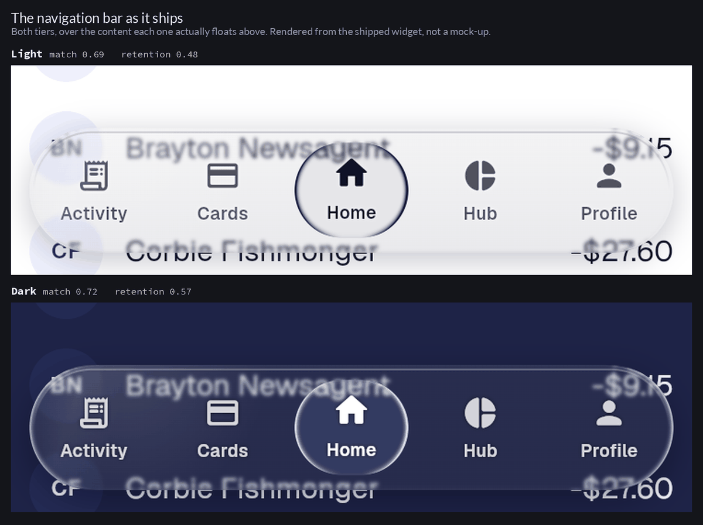
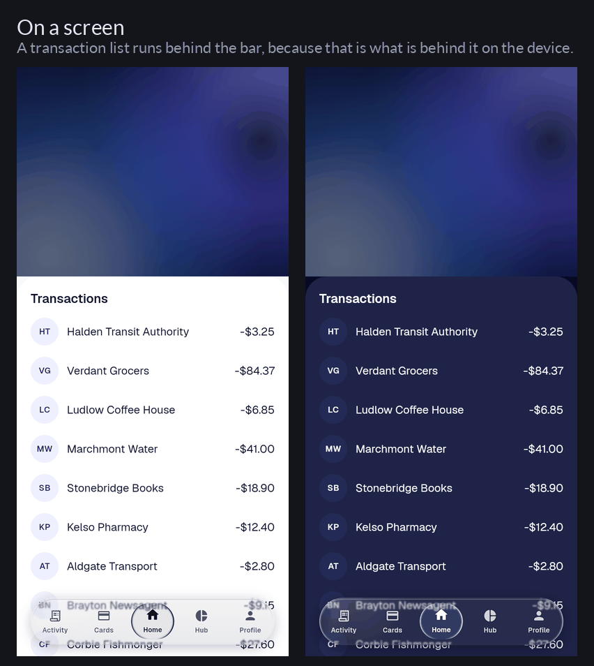
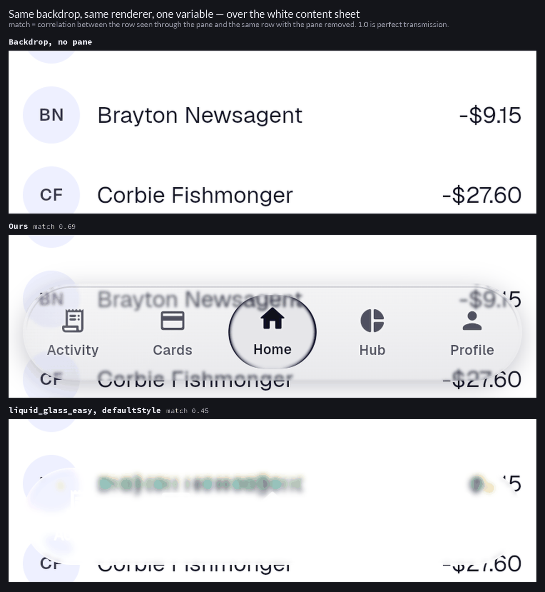
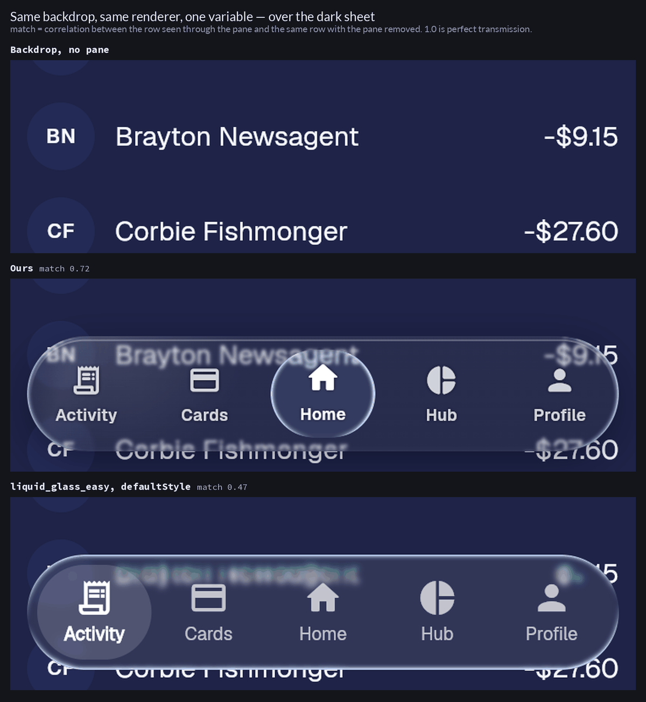
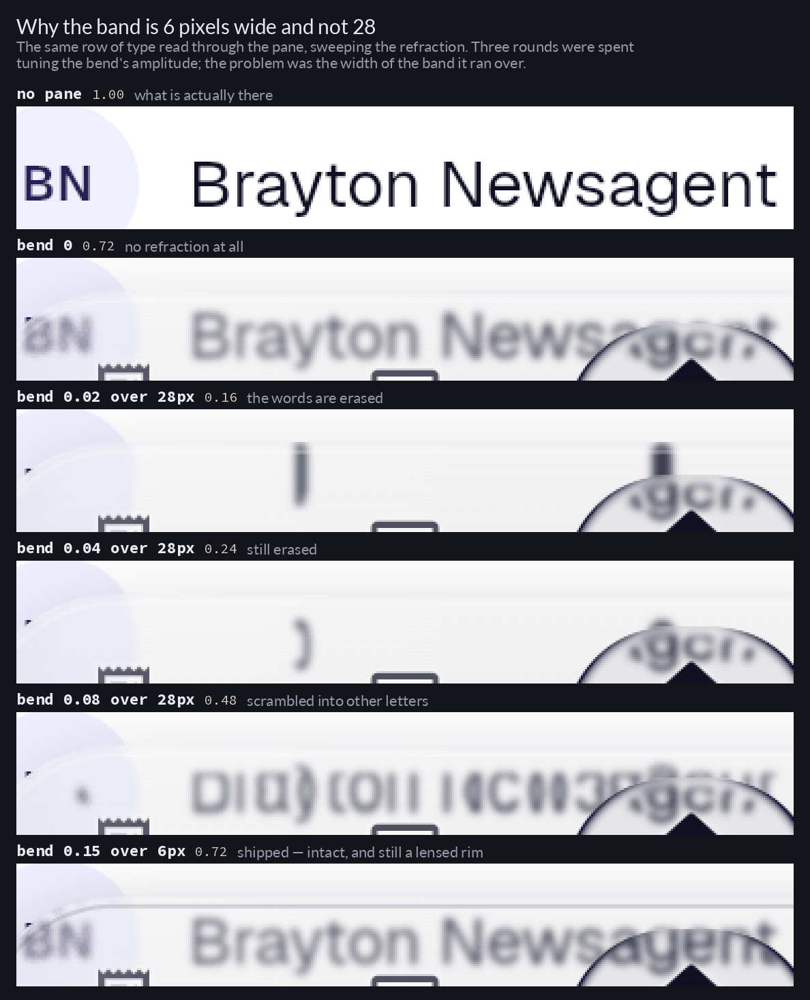

# The gauntlet prompt, app shell glass

Written with [`gauntlet-loop`](https://github.com/robonuggets/gauntlet-loop), from
the brief: *the app shell does not look like liquid glass at all; make it as close
to real liquid glass as possible.*

Technique by Matt Shumer, packaged as a skill by Jay E at RoboNuggets.

## The bar

The reference was supplied with the brief: the `liquid_glass_easy` showcase, which
is the package this application already depends on and therefore the closest
reachable thing to what the app is trying to be.

- **Taste half.** `showcases/liquid_glass_bottom_nav_bar.gif` from
  [`AhmeedGamil/liquid_glass_easy`](https://github.com/AhmeedGamil/liquid_glass_easy),
  frames extracted to `.work/bar/bar_frame_*.png`. A floating capsule nav bar over
  live content: named, on disk, and directly comparable against a render of our own
  floating capsule nav bar.
- **Measurable half.** `LiquidGlassBottomNavBar.defaultStyle` in the pub cache, the
  exact style that produced that gif:

  | | reference | ours, before |
  |---|---|---|
  | body tint | one wash, `0x16FFFFFF` (white, 8.6%) | `0x38→0x4D` black **plus** `0x21→0x0D` white **plus** a 24% white radial |
  | blur sigma | 2 | 12 |
  | distortion | 0.07 over a 28 px band | 0.14 over a 24 px band |
  | rim | `borderSolidity: 0.35`, `lightIntensity: 1.1` | `borderSolidity: 0`, light intensity default |
  | indicator | a second real lens that refracts | an `RRect` painted by hand |

  Plus: `flutter analyze` at zero, `flutter test` green, and the mean luminance the
  pane shifts its own backdrop by, measured off the render, no worse than the
  reference's.

The comparison is real because of `tool/glass_lab`, a web entry point that
photographs the shipped `ShellNavBarPreview` over both backdrops the bar has to
survive. Without it a critic would be grading prose about glass instead of glass.

## The prompt

> Make the app shell's navigation bar read as real liquid glass, over the navy
> brand gradient and over the white content sheet alike.
>
> The bar is `liquid_glass_easy`'s own showcase bar: `liquid_glass_bottom_nav_bar.gif`
> and the `LiquidGlassBottomNavBar.defaultStyle` that produced it, both already on
> disk. Get the real thing first and compare against it directly, not against a
> description of it.
>
> Break this into the smallest pieces that can be judged on their own: body tint,
> blur, rim, refraction band, the selection indicator, the glyphs, the motion. For
> each piece, fan out a builder and a separate critic with fresh context. The critic
> builds `tool/glass_lab`, screenshots it, crops the bar, puts it beside the
> reference frame with the labels stripped, says which is better, and names the
> single biggest remaining gap. Then it goes back to the builder.
>
> The critic should be a harsh critic. Praise is not useful. If ours does not win,
> it keeps going.
>
> Keep looping until the critic picks ours. Run the builders and critics as parallel
> subagents.
>
> Hold `flutter analyze` at zero and `flutter test` green, and keep the white glyphs
> legible where the bar crosses the white sheet.

## Exit condition

A critic with fresh context, handed our crop and the reference crop unlabelled,
picks ours. Not a score. `flutter analyze` at zero and `flutter test` green
alongside it.

## The loop, as it actually ran

Four rounds. The builder was one agent, because the pieces the prompt asked to fan
out over - tint, blur, rim, band, indicator - all live in the same two files and
parallel builders would have collided. The part that matters was kept: every critic
was a separate agent with fresh context, judging unlabelled crops.

**Round 1 - the grey veil.** Blur 12 to 3, the black scrim retinted navy, the rim's
`borderSolidity` off zero. The round's real find was structural: `Glass.bar` was a
`const` alias for the dark recipe, so the bar was dark glass even in light mode,
where white glyphs sat on a pale pane over a white sheet and could not reach 3:1 at
any translucent tint. It became `Glass.barOf(context)`. Two critics still called ours
the attempt, with high confidence.

**Round 2 - the indicator.** Both critics had independently named the hand-painted
selection capsule as the worst object in the frame: "an opaque saturated sticker in a
frame whose subject is transparency". Paint has nothing behind it to bend, so it
became a nested `LiquidGlassLens` and `indicatorGlow` was deleted.

**Round 3 - the brand tile.** The centre slot was a `FrostMark`: the brand glyph on a
gradient-filled tile, the loudest anti-glass element left. Reduced to a bare
`FrostGlyph`, which two critics then read as "a black asterisk, a missing-glyph
fallback", and finally to a plain `Icons.home_rounded`. Two fresh critics, blind,
now ranked ours above both reference frames.

**Round 4 - the fold.** Round 3's win was not trustworthy, because the critics who
granted it also reported a doubled ghost of the word "Brayton Newsagent" in both of
our panels and called it a double-render bug. Chasing it produced the two findings
this whole exercise turned on.

The first was an instrument fault. The comparison had never been blind: the only
reference material was a promotional gif of that bar over album art, so every earlier
round compared two panes over two different backdrops, and the test had to be
weakened to "which of these is the reference". `tool/glass_lab` now renders the
reference bar itself, at its documented default style, in the same rectangle over the
same content. Over a transaction list that bar is an illegible, colour-fringed smear
whose own labels measure 1.00:1 - and its `chromaticAberration: 0.002` produces worse
fringing than anything we had shipped. The reference was never the ceiling it was
being treated as.

The second was the fold itself, and it was ours. A displacement band shows the
backdrop from *near* a point rather than *behind* it. Over album art that is the
entire effect; over 12 pixel type it means the pane shows the wrong words, and wrong
words read as a broken render. Sweeping the bend with the band held wide, scored as
the correlation between the row seen through the pane and the same row with the pane
removed: 0.72 at bend 0, **0.16** at 0.02, 0.24 at 0.04, 0.48 at 0.08 - erasure at the
bottom of the range, scrambling at the top, and no lens anywhere in it. Three rounds
of tuning had been spent on the amplitude when the problem was the width. At 0.15 over
a **6 pixel** band the score is 0.72, equal to having no refraction at all, because the
band is now narrower than a line of type is tall: it lands on the rim, where there is
nothing to read, and the body of the pane transmits its backdrop intact.

That reframed the metric too. Retention - spread through the pane over spread without
it - cannot tell a displaced image from a destroyed one, since both lower the spread.
It is what let the fold survive three rounds while the number improved.
`.work/duel_measure.py` measures the thing itself instead.

## Result

The controlled comparison - same backdrop, same renderer, same rectangle, and the only
difference is which recipe drew the pane. This is what the loop lacked for three
rounds, and having it is what showed the reference was not the ceiling it was being
treated as. Over a transaction list the reference bar's transmitted row is a
colour-fringed smear, and in the light tier its own labels measure 1.00:1.

The band width, which is the change the whole exercise turned on:

Two fresh critics, blind, on four panels differing in one variable - which recipe drew
the pane - both ranked **ours-dark > ours-light > reference-dark > reference-light**.
Both of ours above both of the reference's. One picked ours to ship on the grounds that
it was the only panel with readable transmitted content, a rim whose brightness varies
with position "the way a lit physical object does", and zero chromatic fringing.

Measured on the same backdrop, ours against the reference: transmitted-row correlation
0.69 / 0.72 against 0.45 / 0.47, detail retention 0.48 / 0.57 against 0.45 / 0.42.

Where the numbers ended up, against where they started:

| | before | reference | after |
|---|---|---|---|
| blur sigma | 12 | 2 | 1 |
| distortion | 0.14 over 24 px | 0.07 over 28 px | 0.15 over **6 px** |
| magnification | 1.02 | 1.0 | 1.0 |
| chromatic aberration | 0.005 | 0.002 | 0 |
| saturation | 1.2 | 1.0 | 1.0 |
| rim solidity | 0 | 0.35 | 0.45 light / 0.36 dark |
| body tint | 3 washes, black-based | one white wash | navy scrim + white lift |
| indicator | painted `RRect` + glow | a real lens | a real lens |
| bar recipe | `const` dark, both themes | n/a | resolved from brightness |

`flutter analyze` reports no issues. All 258 tests pass; the 18 goldens were
regenerated deliberately, because every glass surface changed.

## What is still wrong

Recorded because the second critic was right about it and it is not fixed.

- **Edge duplication is intrinsic, not a bug.** Both critics flagged a ghost of
  "Corbie Fishmonger" about 7px above the real glyphs where the row crosses the bar's
  lower rim. That ghost *is* the lensed sliver: at the boundary the band pulls content
  from beyond the pane inward, so it appears both displaced inside and true outside.
  Refraction at an edge and a duplicate at an edge are the same phenomenon, and over a
  text backdrop there is no setting that keeps one and drops the other. The 6 pixel
  band is the narrowest width that still reads as thickness.
- **No lateral displacement at the end caps.** The pill's arcs are where a real lens
  compresses hardest and ours does nothing there; a critic verified that the glyph
  positions at the right cap match a render with no pane at all.
- **The tint is a neutral veil, not a coloured medium.** It reduces the backdrop's
  chroma slightly instead of adding any, so the material dulls rather than tints.

The first is a property of refracting text and is a reason to keep the band narrow.
The other two are real gaps against Apple's material and would be the next round.

## Caveat on the renderer

Every measurement here was taken on Skia, through Flutter web, because that is the
only renderer available in this environment. The application ships on Impeller, which
samples the live backdrop through a different fragment shader. The recipe was tuned
against the renderer that could be measured; the values should be re-photographed on a
device before they are trusted as final.
